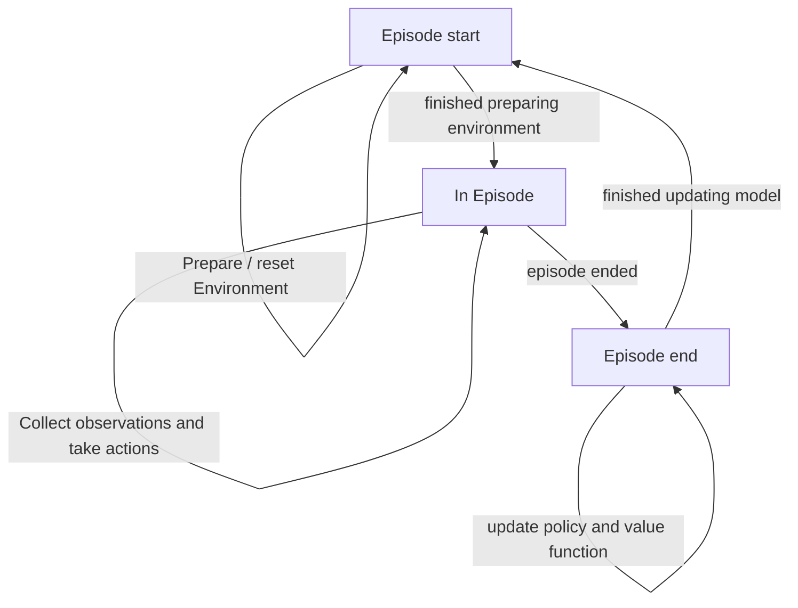
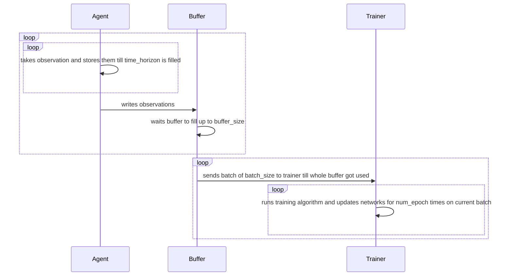

```mermaid
flowchart TB
      A[Episode start]
      B[In Episode]
      C[Episode end]
      A-->|Prepare / reset Environment|A
      A-->|finished preparing environment|B
      B-->|Collect observations and take actions|B
      B-->|episode ended|C
      C-->|update policy and value function|C
      C-->|finished updating model|A
```

## Visualize hyper parameters on one observation -> training iteration

```mermaid
sequenceDiagram
    participant Agent
    participant Buffer
    participant Trainer
    loop
    loop
		    Agent->>Agent: takes observation and stores them till time_horizon is filled
	    end
		    Agent->>Buffer: writes observations
		    Buffer->>Buffer: waits buffer to fill up to buffer_size
    end
    loop
	    Buffer->>Trainer: sends batch of batch_size to trainer till whole buffer got used
	    loop
		    Trainer->>Trainer: runs training algorithm and updates networks for num_epoch times on current batch
	    end
    end
```

Python LLAPI erstellt environment mit RpcCommunicator -> updatet pro step oder on reset die Daten von unity